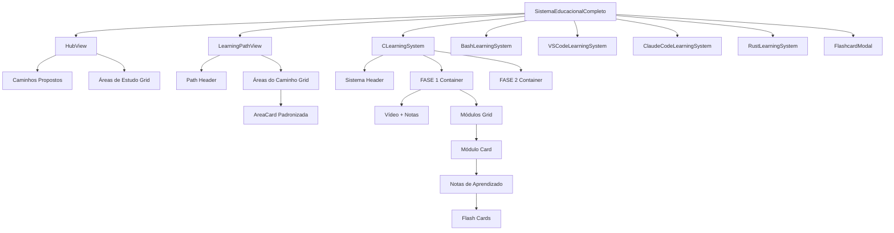
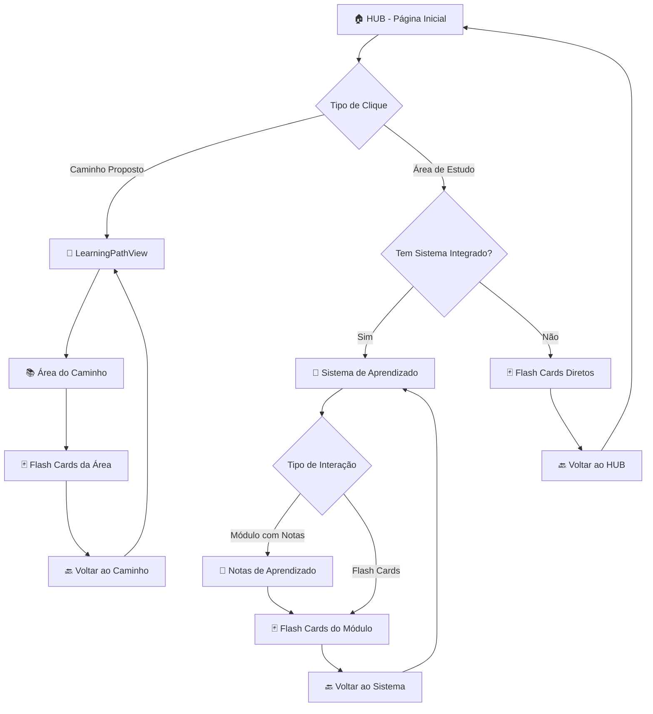
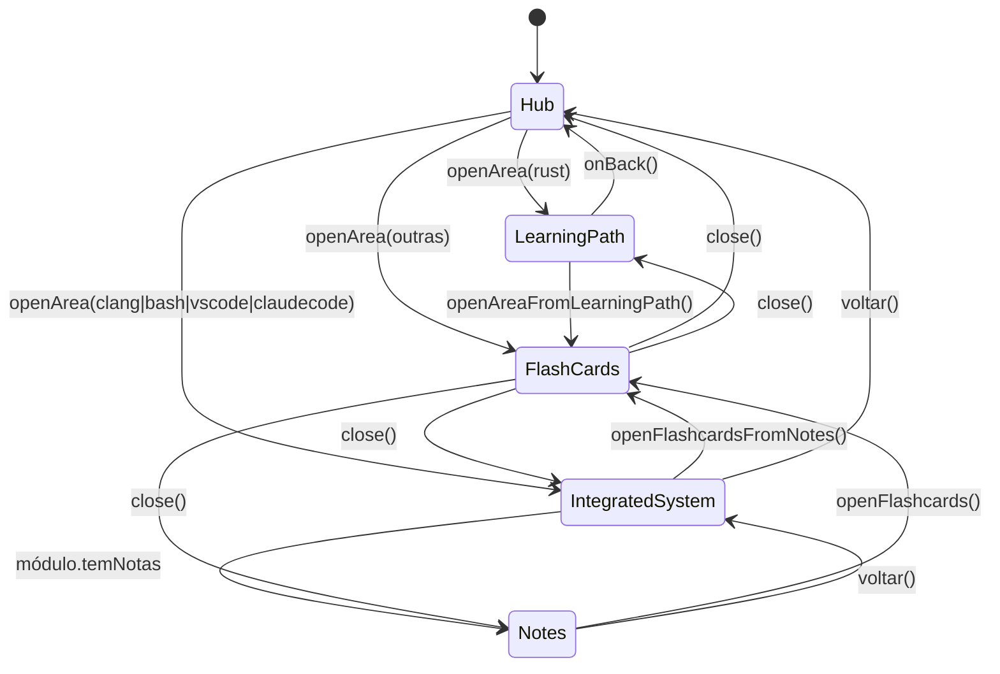

# 🏗️ Arquitetura e Padrões - Sistema Educacional Completo

**Data:** Janeiro 2025  
**Versão:** 2.0  
**Status:** Documentação Técnica Oficial  

---

## 📋 **ÍNDICE**

1. [Estrutura de Navegação](#estrutura-de-navegação)
2. [Hierarquia de Componentes](#hierarquia-de-componentes)
3. [Padrões UX/UI](#padrões-uxui)
4. [Fluxogramas de Navegação](#fluxogramas-de-navegação)
5. [Componentes Padronizados](#componentes-padronizados)
6. [Estados e Interações](#estados-e-interações)

---

## 🗂️ **ESTRUTURA DE NAVEGAÇÃO**

### **Hierarquia Oficial do Sistema**

```
🏠 HUB (Página Initial)
├── 🎯 Caminhos Propostos (Learning Paths)
│   └── 🦀 Rust → LearningPathView
│       ├── 📚 Terminal Warp (Área de Estudo)
│       ├── 📚 Vim Motions (Área de Estudo)
│       ├── 📚 Linguagem Rust (Área de Estudo)
│       ├── 📚 DevOps (Área de Estudo)
│       ├── 📚 Servidores (Área de Estudo)
│       ├── 📚 Segurança (Área de Estudo)
│       ├── 📚 Criptografia (Área de Estudo)
│       └── 🚀 Card "Linguagem Rust" → Navegação para Sistema Integrado Rust
├── 📖 Áreas de Estudo (Study Areas)
│   ├── 🔨 Sistemas de Aprendizado C
│   │   ├── 🎥 FASE 1: Fundamentos C Programming
│   │   │   ├── 📋 Módulos/Tópicos
│   │   │   │   └── 📝 Notas de Aprendizado
│   │   │   │       └── 🃏 Flash Cards
│   │   │   ├── 🎬 Vídeo de Apoio
│   │   │   └── 📝 Notas Rápidas
│   │   └── 🚀 FASE 2: Site da Agência HTTP/3 + Zero Trust
│   │       └── 📋 Módulos/Tópicos
│   │           └── 📝 Notas de Aprendizado
│   │               └── 🃏 Flash Cards
│   ├── 🦀 Sistemas de Aprendizado Rust
│   │   ├── 🎥 FASE 1: Fundamentos Rust Programming (24 módulos)
│   │   │   ├── 📋 Módulos/Tópicos
│   │   │   │   └── 📝 Notas de Aprendizado
│   │   │   │       └── 🃏 Flash Cards
│   │   │   ├── 🎬 Vídeo de Apoio (YouTube)
│   │   │   └── 📝 Notas Rápidas
│   │   └── 🚀 FASE 2: Projeto Avançado Rust + Sistemas
│   │       └── 📋 Módulos/Tópicos
│   │           └── 📝 Notas de Aprendizado
│   │               └── 🃏 Flash Cards
│   ├── 🐚 Sistemas de Aprendizado Bash
│   ├── 💻 Sistemas de Aprendizado VSCode WSL
│   ├── 🤖 Sistemas de Aprendizado Claude Code
│   └── 📚 Outras Áreas (Flash Cards Diretos)
└── 🃏 Modal Flash Cards (Global)
```

---

## 🏗️ **HIERARQUIA DE COMPONENTES**

### **Componentes Principais**



---

## 🎨 **PADRÕES UX/UI**

### **1. Cards Padronizados - Áreas de Estudo**

#### **Especificações Técnicas:**
- **Container**: `bg-white rounded-lg shadow-lg p-6 cursor-pointer hover:shadow-xl transition-shadow`
- **Largura**: Responsiva com `md:grid-cols-2 lg:grid-cols-3`
- **Altura**: Auto-ajustável com conteúdo consistente
- **Hover**: Elevação de sombra + transformação sutil

#### **Estrutura Interna:**
```
┌─────────────────────────────────────┐
│ 🎯 Ícone    Título da Área         │ ← Header (flex items-center)
│                                     │
│ Descrição clara e concisa da área   │ ← Description (text-gray-600)
│ de estudo em 1-2 linhas.           │
│                                     │
│ ────────────────────────────────── │ ← Separator
│ X módulos    Y cards    Zh         │ ← Footer Stats (text-sm text-gray-500)
└─────────────────────────────────────┘
```

#### **Badges Opcionais:**
- **Posição**: `absolute top-4 right-4`
- **Estilos**: 
  - `bg-blue-500` + "Integrado" (hasIntegratedApp)
  - `bg-green-500` + "Novo" (badge === 'new')
  - `bg-purple-500` + "Caminho" (isLearningPath)

### **2. Learning Path Cards (Caminhos Propostos)**

#### **Especificações Técnicas:**
- **Container**: `bg-gradient-to-br from-purple-600 to-blue-600 rounded-lg shadow-xl p-8 cursor-pointer hover:shadow-xl transition-all transform hover:-translate-y-1 text-white`
- **Layout**: Diferenciado com gradiente e destaque visual
- **Ícone**: `text-6xl` com posição de destaque

#### **Estrutura Interna:**
```
┌─────────────────────────────────────────────┐
│ 🦀           Rust                    🎯    │ ← Header com ícone grande
│              Caminho de Aprendizado        │
│                                             │
│ Descrição do caminho estruturado...        │ ← Description
│                                             │
│ ┌──────────┐ ┌──────────┐ ┌──────────┐    │ ← Grid 2x2 das primeiras áreas
│ │1.Terminal│ │2.Vim     │ │3.Rust    │    │
│ │ Warp     │ │ Motions  │ │ Lang     │    │
│ └──────────┘ └──────────┘ └──────────┘    │
│ ┌──────────┐     +4 áreas adicionais      │
│ │4.DevOps  │                              │
│ └──────────┘                              │
│                                             │
│ 35 módulos    140h total    →             │ ← Footer
└─────────────────────────────────────────────┘
```

### **3. Learning Path Detail Cards (Dentro do Caminho)**

#### **⚠️ PROBLEMA IDENTIFICADO - PRECISA PADRONIZAÇÃO**
Atualmente os cards dentro do caminho Rust estão diferentes do padrão. Devem seguir o **mesmo padrão** dos cards da página inicial.

### **4. NOVO: Card "Linguagem Rust" - Navegação Cross-System**

#### **Localização**: Card "rustLang" dentro do grid de áreas do Learning Path Rust

#### **Funcionalidade**:
O card "Linguagem Rust" possui comportamento especial - em vez de abrir flashcards, navega diretamente para o Sistema Integrado de Rust:

```
┌─────────────────────────────────────────────┐
│ 📚 Linguagem Rust              🚀 Sistema  │ ← Badge diferenciado
│                                             │
│ Preview dos flashcards:                     │ ← Preview normal
│ • Como instalar Rust?                      │
│ • Como criar um projeto Rust?              │
│                                             │
│ 4 cards    🚀 Sistema Integrado    Área 3  │ ← Footer diferenciado
└─────────────────────────────────────────────┘
```

#### **Diferenciação Visual:**
- **Background**: Gradiente `from-orange-50 to-red-50` com borda laranja
- **Badge**: "🚀 Sistema" em vez do número sequencial
- **Footer**: "🚀 Sistema Integrado" em vez de "⏱️ Estudar"

#### **Implementação Técnica:**
- **Condicional**: `if (areaKey === 'rustLang' && onNavigateToIntegrated)`
- **Navegação**: `onNavigateToIntegrated('rustprogramming')`
- **Styling**: Diferenciado apenas para `areaKey === 'rustLang'`

#### **Padronização Necessária:**
```
┌─────────────────────────────────────┐
│ 📚 Terminal Warp            [1]     │ ← Header padrão (ícone + título + sequência)
│                                     │
│ Preview dos primeiros flashcards:   │ ← Conteúdo específico do caminho
│ • Como instalar Warp Terminal?     │
│ • Principais recursos do Warp      │ ← Preview de 2 cards
│                                     │
│ +5 flashcards adicionais           │ ← Indicador de mais conteúdo
│ ────────────────────────────────── │
│ 7 flashcards    ⏱ Estudar          │ ← Footer padrão
└─────────────────────────────────────┘
```

### **4. Sistema de Aprendizado - Layout**

#### **Cabeçalho Padrão:**
```
┌──────────────────────────────────────────────┐
│ ← Voltar    Sistemas de Aprendizado C   85% │ ← Navigation + Title + Progress
│             2 Sistemas Integrados:          │
│             FASE 1: Fund. C → FASE 2: HTTP/3│ ← Subtitle com cores diferenciadas
└──────────────────────────────────────────────┘
```

#### **Seções de Fase:**
```
┌─────────────────────────────────────────────────────────────┐
│ 🔵 FASE 1: FUNDAMENTOS C PROGRAMMING    🎥 Com Vídeo  1/2  │ ← Header roxo/indigo
│                                        Semanas 1-8        │
├─────────────────────────────────────────────────────────────┤
│                                                             │ ← Conteúdo da fase (indigo-50)
│ 🎥 Vídeo de Apoio - Fundamentos C Programming              │
│ ┌─────────────────────────────────────────────────────────┐ │
│ │                 [PLAYER YOUTUBE]                        │ │
│ └─────────────────────────────────────────────────────────┘ │
│                                                             │
│ 📝 Notas Rápidas - Fundamentos C                           │
│ ┌─────────────────────────────────────────────────────────┐ │
│ │ [TEXTAREA DE NOTAS]                                     │ │
│ └─────────────────────────────────────────────────────────┘ │
├─────────────────────────────────────────────────────────────┤
│ 📋 Módulos da FASE 1                                        │ ← Lista de módulos
│                                                             │
│ ✅ Introdução C + Variáveis                 Ver Notas      │
│    Semana 1 - 28/07/2025                                   │
│    Entregável: Setup VSCode + primeiro programa            │
│                                                             │
└─────────────────────────────────────────────────────────────┘
```

---

## 🔄 **FLUXOGRAMAS DE NAVEGAÇÃO**

### **Fluxo Principal de Navegação**



### **Fluxo de Estados dos Componentes**



### **Fluxo de Dados e Props**

```mermaid
graph LR
    A[studyAreas.js] --> B[SistemaEducacionalCompleto]
    B --> C[currentView State]
    B --> D[currentArea State]
    B --> E[flashcardModal State]
    
    C --> F[HubView]
    C --> G[LearningPathView]
    C --> H[IntegratedSystems]
    
    D --> I[studyAreas[currentArea]]
    I --> G
    I --> H
    
    E --> J[FlashcardModal]
    J --> K[currentCards]
    J --> L[currentCardIndex]
```

---

## 🧩 **COMPONENTES PADRONIZADOS**

### **1. AreaCard (Componente Base)**

#### **Props Interface:**
```typescript
interface AreaCardProps {
  title: string;
  icon: string;
  description: string;
  modules: number;
  cards: number;
  hours: number;
  badge?: 'integrated' | 'new' | 'path';
  onClick: () => void;
  variant?: 'default' | 'learning-path' | 'path-area';
}
```

#### **Variantes:**
- **default**: Cards da página inicial (áreas de estudo)
- **learning-path**: Cards em destaque (caminhos propostos)  
- **path-area**: Cards dentro dos caminhos (PRECISA PADRONIZAR)

### **2. SystemHeader (Cabeçalho dos Sistemas)**

#### **Props Interface:**
```typescript
interface SystemHeaderProps {
  title: string;
  subtitle: string;
  progress: number;
  totalModules: number;
  completedModules: number;
  onBack: () => void;
}
```

### **3. PhaseSection (Seções de Fase)**

#### **Props Interface:**
```typescript
interface PhaseSectionProps {
  phase: Phase;
  modules: Module[];
  completedModules: Set<string>;
  onModuleClick: (moduleId: string) => void;
  children?: React.ReactNode; // Para vídeo e notas
}
```

---

## 🎛️ **ESTADOS E INTERAÇÕES**

### **Estados Globais (SistemaEducacionalCompleto)**

```typescript
// Navigation States
const [currentView, setCurrentView] = useState<'hub' | 'learningPath' | 'integrated' | 'notes'>('hub');
const [currentArea, setCurrentArea] = useState<string | null>(null);
const [currentSubView, setCurrentSubView] = useState<string>('calendar');

// Flash Cards States  
const [flashcardModalOpen, setFlashcardModalOpen] = useState(false);
const [currentCards, setCurrentCards] = useState<FlashCard[]>([]);
const [currentCardIndex, setCurrentCardIndex] = useState(0);
const [isFlipped, setIsFlipped] = useState(false);

// Learning Systems States
const [completedModules, setCompletedModules] = useState(new Set<string>());
const [selectedSection, setSelectedSection] = useState('');
```

### **Funções de Navegação Padrão**

```typescript
// Abrir área do hub
const openArea = (areaKey: string) => {
  const area = studyAreas[areaKey];
  
  if (area.isLearningPath) {
    setCurrentView('learningPath');
  } else if (area.hasIntegratedApp) {
    setCurrentView('integrated');
  } else {
    // Flash cards diretos
    openFlashcards(area.flashcards);
  }
};

// Abrir área do caminho
const openAreaFromLearningPath = (areaKey: string, areaData: AreaData) => {
  setCurrentCards(areaData.cards);
  setFlashcardModalOpen(true);
};

// Voltar para hub
const goToHub = () => {
  setCurrentView('hub');
  setCurrentArea(null);
};
```

---

## 📝 **TERMINOLOGIA PADRÃO ATUALIZADA**

### **Correção Implementada: Janeiro 2025**

**❌ Terminologia Anterior:**
- "Conteúdo da Aula" (nas notas de aprendizado)

**✅ Terminologia Atual:**
- **"Conteúdo do Tópico"** (padronizado em todos os componentes)

**Arquivos Corrigidos:**
- `/src/components/BashNotesView.jsx:314`
- `/src/components/CNotesView.jsx:208` 
- `/arquivo.jsx:906` (arquivo legado)

**Justificativa:**
A mudança de "Aula" para "Tópico" reflete melhor a estrutura modular do sistema educacional, onde cada seção representa um tópico específico de aprendizado dentro de módulos maiores.

---

## 🚨 **PROBLEMAS IDENTIFICADOS E CORREÇÕES NECESSÁRIAS**

### **1. URGENTE: Padronizar Cards do Caminho Rust**

#### **Problema:**
Os cards dentro do `LearningPathView` estão usando layout diferente do padrão estabelecido na página inicial.

#### **Localização:**
- Arquivo: `/src/components/LearningPathView.jsx`  
- Seção: Grid de áreas (linhas ~95-135)

#### **Correção Necessária:**
Substituir o layout atual pelos mesmos estilos dos cards da página inicial:
- Usar `bg-white rounded-lg shadow-lg` em vez do layout atual
- Padronizar header com ícone + título
- Footer com estatísticas consistente
- Hover effects padronizados

### **2. Inconsistência de Cores**

#### **Problema:**
Diferentes seções usam cores diferentes sem padrão definido.

#### **Padrão a Implementar:**
- **Caminhos Propostos**: Purple/Blue gradient
- **FASE 1**: Indigo (`bg-indigo-500`, `bg-indigo-50`)
- **FASE 2**: Blue (`bg-blue-500`, `bg-blue-50`)  
- **Bash**: Green (`bg-green-500`)
- **VSCode**: Purple (`bg-purple-500`)
- **Claude Code**: Purple (`bg-purple-500`)

### **3. Falta de Componente Reutilizável**

#### **Problema:**
Cards são definidos inline em cada componente.

#### **Solução:**
Criar componente `AreaCard.jsx` reutilizável com as 3 variantes.

---

## 📋 **CHECKLIST DE IMPLEMENTAÇÃO**

### **Fase 1: Padronização Urgente**
- [ ] Corrigir cards do LearningPathView para usar padrão consistente
- [ ] Criar componente AreaCard reutilizável  
- [ ] Definir paleta de cores oficial
- [ ] Padronizar hover effects e transitions

### **Fase 2: Componentização**
- [ ] Extrair SystemHeader como componente
- [ ] Extrair PhaseSection como componente
- [ ] Criar interface TypeScript para props
- [ ] Implementar testes de componentes

### **Fase 3: UX/UI Avançado**
- [ ] Animações de transição entre views
- [ ] Loading states consistentes  
- [ ] Error boundaries padronizados
- [ ] Accessibility (ARIA labels, keyboard navigation)

---

## 🎯 **PRÓXIMAS AÇÕES IMEDIATAS**

1. **Corrigir LearningPathView**: Padronizar cards do caminho Rust
2. **Criar AreaCard**: Componente reutilizável com 3 variantes
3. **Definir Design System**: Cores, espacamentos, tipografia
4. **Documentar Componentes**: Props, exemplos, variantes
5. **Testar Consistência**: Verificar todos os caminhos de navegação

---

**Documento vivo - Atualizar conforme evolução do sistema**  
**Responsável:** Sistema de Desenvolvimento  
**Próxima revisão:** Após implementação das correções urgentes