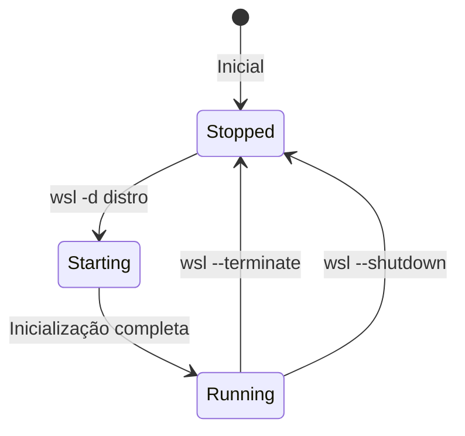

# 📦 Módulo 0.1: Administração de Múltiplas Distribuições WSL2

## 📋 Visão Geral

Este módulo ensina os conceitos fundamentais do WSL2 e como administrar múltiplas distribuições Linux simultaneamente no Windows 11.

## 🎯 História de Usuário

> "Como um administrador de sistema, quero ser capaz de instalar, listar, parar e remover diferentes distribuições WSL2 para que eu possa criar ambientes de aprendizado isolados e específicos para cada tópico, explorando as nuances de Ubuntu e Arch Linux."

## 📚 Conteúdo Teórico

### 1. Entendendo a Virtualização Leve do WSL2

#### O que é WSL2?

O WSL2 (Windows Subsystem for Linux, Versão 2) representa uma evolução significativa em relação ao WSL1. Em vez de uma camada de compatibilidade para chamadas de sistema Linux, o WSL2 utiliza uma máquina virtual leve baseada em um kernel Linux real, gerenciado pelo Hyper-V do Windows.

#### Conceitos Fundamentais

**Virtualização Leve:**
- Diferente de VMs tradicionais (VMware, VirtualBox)
- Otimizado para integração com Windows
- Não inicializa SO completo a cada vez
- Compartilha recursos e kernel compacto
- Inicialização rápida e menor sobrecarga

**Compartilhamento de Kernel:**
- Todas as distros WSL2 compartilham o mesmo kernel Linux
- Atualizações no kernel afetam todas as distros
- Gestão centralizada de recursos (CPU, RAM, disco)
- Configuração via `.wslconfig`

**Gerenciamento de Recursos:**

| Recurso | Comportamento | Configuração |
|---------|--------------|--------------|
| **CPU** | Alocação dinâmica | `processors=` em .wslconfig |
| **RAM** | Até limite configurável | `memory=` em .wslconfig |
| **Disco** | VHDX dinâmico por distro | Cresce conforme uso |
| **Estado** | Running/Stopped/Starting | Comandos wsl |

### 2. Estados das Distribuições



## 🛠️ Conteúdo Prático

### Passo 1: Verificar Pré-requisitos

```powershell
# PowerShell como Administrador
# Verificar se WSL está instalado
wsl --status

# Se não estiver, instalar WSL2
wsl --install

# Verificar versão do Windows
winver  # Deve ser 22000 ou superior
```

### Passo 2: Instalar Ubuntu 24.04 LTS

```powershell
# Listar distribuições disponíveis
wsl --list --online

# Instalar Ubuntu
wsl --install -d Ubuntu-24.04

# Configurar usuário e senha durante primeira execução
# Username: joao
# Password: [sua_senha_segura]
```

### Passo 3: Instalar Arch Linux

O Arch Linux requer instalação manual via ArchWSL:

```powershell
# 1. Criar diretório para Arch
New-Item -ItemType Directory -Path "D:\WSL_Distros\ArchLinux" -Force

# 2. Baixar ArchWSL
# Navegue até: https://github.com/yuk7/ArchWSL/releases
# Baixe a última versão (Arch.zip)

# 3. Extrair para o diretório criado
Expand-Archive -Path ".\Arch.zip" -DestinationPath "D:\WSL_Distros\ArchLinux"

# 4. Executar instalador
D:\WSL_Distros\ArchLinux\Arch.exe

# 5. Configurar usuário
# No Arch Linux:
```

```bash
# Dentro do Arch Linux
# Atualizar sistema
sudo pacman -Syu

# Criar usuário
useradd -m -G wheel -s /bin/bash joao
passwd joao

# Configurar sudo
echo "%wheel ALL=(ALL) ALL" >> /etc/sudoers

# Instalar ferramentas essenciais
sudo pacman -S base-devel git vim nano wget curl
sudo pacman -S nasm qemu gcc gdb make
```

### Passo 4: Configurar Recursos (.wslconfig)

Crie o arquivo `C:\Users\[SeuUsuario]\.wslconfig`:

```ini
[wsl2]
# Configurações globais
memory=8GB           # RAM máxima total
processors=4         # CPUs virtuais
swap=2GB            # Arquivo swap
localhostForwarding=true

# Configurações por distro
[Ubuntu-24.04]
memory=4GB
processors=2

[ArchLinux]
memory=2GB
processors=2
```

Aplicar configurações:
```powershell
wsl --shutdown
# As configurações serão aplicadas na próxima inicialização
```

### Passo 5: Renomear e Organizar Distros

```powershell
# Exportar distro atual
wsl --export Ubuntu-24.04 D:\wsl_backups\Ubuntu-OSDev.tar

# Desregistrar distro antiga
wsl --unregister Ubuntu-24.04

# Importar com novo nome
wsl --import Ubuntu-OSDev D:\WSL_Distros\Ubuntu-OSDev D:\wsl_backups\Ubuntu-OSDev.tar --version 2

# Definir distro padrão
wsl --set-default Ubuntu-OSDev
```

## 📝 Comandos Essenciais WSL

### Gerenciamento Básico

| Comando | Descrição | Exemplo |
|---------|-----------|---------|
| `wsl -l -v` | Listar distros e status | `wsl --list --verbose` |
| `wsl -d <nome>` | Abrir distro específica | `wsl -d ArchLinux` |
| `wsl --terminate <nome>` | Parar distro | `wsl --terminate Ubuntu-OSDev` |
| `wsl --shutdown` | Parar todas as distros | `wsl --shutdown` |
| `wsl --set-default <nome>` | Definir distro padrão | `wsl --set-default Ubuntu-OSDev` |

### Backup e Restauração

```powershell
# Exportar (backup)
wsl --export Ubuntu-OSDev backup.tar

# Importar (restaurar)
wsl --import Ubuntu-Restored D:\WSL\Restored backup.tar

# Script de backup automatizado
$date = Get-Date -Format "yyyyMMdd_HHmmss"
$distro = "Ubuntu-OSDev"
$backupPath = "D:\wsl_backups\$distro_$date.tar"
wsl --export $distro $backupPath
Write-Host "Backup criado: $backupPath"
```

## 🧪 Exercícios Práticos

### Exercício 1: Setup Multi-Distro

1. Instale Ubuntu e Arch Linux
2. Configure cada uma com ferramentas de desenvolvimento
3. Crie um script PowerShell que:
   - Lista todas as distros
   - Mostra uso de recursos
   - Permite alternar entre elas

### Exercício 2: Gestão de Recursos

1. Crie diferentes configurações .wslconfig
2. Teste limites de memória e CPU
3. Monitore performance com:
   - Task Manager (Windows)
   - `htop` (dentro do WSL)

### Exercício 3: Sistema de Backup

Implemente um script PowerShell que:
```powershell
# TODO(human): Implementar função de backup
# - Verificar espaço em disco disponível
# - Exportar todas as distros
# - Manter apenas os 3 backups mais recentes
# - Enviar notificação de conclusão
```

## 📊 Validação do Módulo

### Checklist de Conclusão

- [ ] WSL2 instalado e funcional
- [ ] Ubuntu 24.04 configurado
- [ ] Arch Linux configurado
- [ ] .wslconfig criado e aplicado
- [ ] Comandos básicos dominados
- [ ] Sistema de backup implementado

### Teste de Conhecimento

1. **Qual a diferença entre WSL1 e WSL2?**
   <details>
   <summary>Resposta</summary>
   WSL1 usa tradução de chamadas de sistema, WSL2 usa virtualização com kernel Linux real
   </details>

2. **Como liberar memória RAM do WSL2?**
   <details>
   <summary>Resposta</summary>
   Use `wsl --shutdown` para parar todas as distros e liberar recursos
   </details>

3. **Onde ficam armazenados os arquivos das distros?**
   <details>
   <summary>Resposta</summary>
   Em arquivos VHDX no diretório especificado durante importação ou em AppData/Local/Packages
   </details>

## 🚨 Troubleshooting

### Problema: WSL2 não inicia

```powershell
# Verificar features do Windows
dism.exe /online /enable-feature /featurename:Microsoft-Windows-Subsystem-Linux /all /norestart
dism.exe /online /enable-feature /featurename:VirtualMachinePlatform /all /norestart

# Reiniciar computador
Restart-Computer
```

### Problema: Erro de virtualização

1. Entrar na BIOS/UEFI
2. Habilitar:
   - Intel: VT-x e VT-d
   - AMD: AMD-V e IOMMU
3. Salvar e reiniciar

### Problema: Disco VHDX muito grande

```powershell
# Compactar VHDX
wsl --shutdown
$vhdxPath = "caminho\para\ext4.vhdx"
Optimize-VHD -Path $vhdxPath -Mode Full
```

## 📚 Recursos Complementares

### Scripts Úteis

```bash
# Script de configuração inicial (salvar como setup.sh)
#!/bin/bash
echo "Configurando ambiente de desenvolvimento..."

# Atualizar sistema
sudo apt update && sudo apt upgrade -y

# Instalar ferramentas
sudo apt install -y \
    build-essential \
    git vim tmux \
    htop neofetch \
    curl wget \
    python3 python3-pip \
    nodejs npm

# Configurar Git
git config --global user.name "João"
git config --global user.email "joao@example.com"

echo "Configuração concluída!"
```

### Aliases Úteis

Adicione ao `~/.bashrc` ou `~/.zshrc`:

```bash
# Navegação WSL
alias winHome='cd /mnt/c/Users/[SeuUsuario]'
alias projects='cd ~/workspace/learning'

# Comandos WSL do Linux
alias wslconfig='vim /mnt/c/Users/[SeuUsuario]/.wslconfig'
alias wslbackup='powershell.exe wsl --export Ubuntu-OSDev backup.tar'

# Informações do sistema
alias wslinfo='echo "Distro: $(lsb_release -ds)" && echo "Kernel: $(uname -r)" && echo "Memory: $(free -h | grep Mem)"'
```

## ➡️ Próximo Módulo

Após dominar a administração de distros, prossiga para:
[📦 Módulo 0.2: Configuração de Ambientes Isolados](./02_distros_multiplas.md)

---

**Tempo estimado para este módulo:** 10 horas  
**Nível de dificuldade:** ⭐⭐☆☆☆ (2/5)