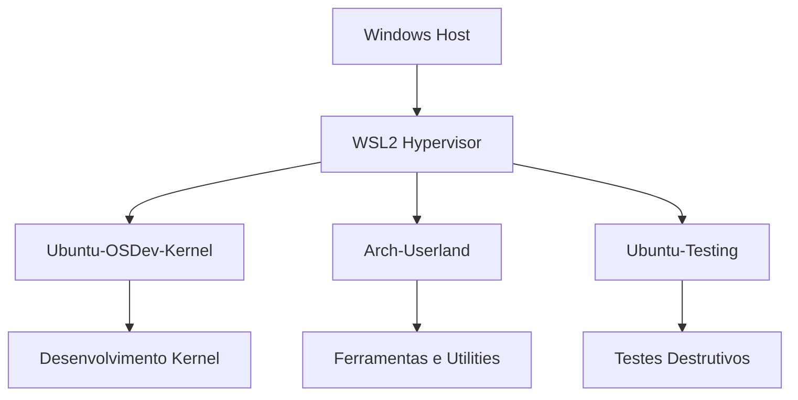

# 🔒 Módulo 0.2: Configuração de Ambientes Isolados

## 📋 Visão Geral

Este módulo foca na configuração de ambientes de desenvolvimento isolados e seguros, com integração completa com ferramentas modernas como VSCode e terminais avançados.

## 🎯 Objetivos de Aprendizado

- Configurar ambientes isolados para diferentes projetos
- Integrar VSCode com múltiplas distros WSL2
- Implementar estratégias de segurança e backup
- Otimizar performance e uso de recursos

## 📚 Conteúdo Teórico

### 1. Princípio de Isolamento

#### Por que Isolamento é Crucial?

No desenvolvimento de sistemas operacionais, erros podem ser catastróficos:
- Comandos destrutivos (`rm -rf /`)
- Corrupção de sistema de arquivos
- Conflitos de dependências
- Vazamento de memória

#### Estratégia Multi-Laboratório



### 2. Integração com Ferramentas de Desenvolvimento

#### VSCode Remote Development

O VSCode oferece integração transparente com WSL2:
- Execução nativa no Linux
- IntelliSense completo
- Debugging integrado
- Terminal incorporado

#### Terminais Modernos

- **Windows Terminal**: Multi-aba, temas, GPU accelerated
- **Warp**: AI-powered, blocos de comando
- **Tabby**: Cross-platform, sync configs

## 🛠️ Configuração Prática

### Passo 1: Configurar VSCode para WSL

#### Instalação de Extensões

```bash
# No Windows, instale as extensões
code --install-extension ms-vscode-remote.remote-wsl
code --install-extension ms-vscode.cpptools
code --install-extension ms-vscode.cmake-tools
```

#### Configuração por Distro

Crie `.vscode/settings.json` em cada projeto:

```json
{
    "terminal.integrated.defaultProfile.linux": "bash",
    "terminal.integrated.profiles.linux": {
        "bash": {
            "path": "/bin/bash",
            "icon": "terminal-bash"
        },
        "zsh": {
            "path": "/bin/zsh",
            "icon": "terminal"
        }
    },
    "C_Cpp.default.compilerPath": "/usr/bin/gcc",
    "C_Cpp.default.intelliSenseMode": "linux-gcc-x64",
    "files.watcherExclude": {
        "**/target/**": true,
        "**/node_modules/**": true
    }
}
```

#### Abrir Projetos no WSL

```bash
# Método 1: Do WSL
cd ~/workspace/projeto
code .

# Método 2: Do Windows PowerShell
code --folder-uri wsl.localhost/Ubuntu-OSDev/home/joao/workspace/projeto

# Método 3: Via Remote Explorer no VSCode
# Ctrl+Shift+P -> "Remote-WSL: New Window"
```

### Passo 2: Configurar Windows Terminal

#### Perfis Customizados

Edite `settings.json` do Windows Terminal:

```json
{
    "profiles": {
        "list": [
            {
                "guid": "{07b52e3e-de2c-5db4-bd2d-ba144ed6c273}",
                "name": "🐧 Ubuntu OSDev",
                "source": "Windows.Terminal.Wsl",
                "commandline": "wsl.exe -d Ubuntu-OSDev",
                "startingDirectory": "//wsl$/Ubuntu-OSDev/home/joao/workspace",
                "colorScheme": "Ubuntu",
                "icon": "ms-appx:///ProfileIcons/{9acb9455-ca41-5af7-950f-6bca1bc9722f}.png",
                "tabTitle": "Ubuntu OS",
                "fontFace": "Cascadia Code PL"
            },
            {
                "guid": "{17b52e3e-de2c-5db4-bd2d-ba144ed6c274}",
                "name": "🏗️ Arch Tools",
                "commandline": "wsl.exe -d ArchLinux",
                "startingDirectory": "//wsl$/ArchLinux/home/joao",
                "colorScheme": "Arch",
                "icon": "🏗️",
                "tabTitle": "Arch",
                "fontFace": "JetBrains Mono"
            }
        ]
    },
    "schemes": [
        {
            "name": "Ubuntu",
            "background": "#300A24",
            "foreground": "#EEEEEC",
            "black": "#2E3436",
            "blue": "#3465A4",
            "brightBlack": "#555753",
            "brightBlue": "#729FCF",
            "brightCyan": "#34E2E2",
            "brightGreen": "#8AE234",
            "brightPurple": "#AD7FA8",
            "brightRed": "#EF2929",
            "brightWhite": "#EEEEEC",
            "brightYellow": "#FCE94F",
            "cyan": "#06989A",
            "green": "#4E9A06",
            "purple": "#75507B",
            "red": "#CC0000",
            "white": "#D3D7CF",
            "yellow": "#C4A000"
        },
        {
            "name": "Arch",
            "background": "#0C0C0C",
            "foreground": "#CCCCCC",
            "black": "#000000",
            "blue": "#0D68A8",
            "brightBlack": "#666666",
            "brightBlue": "#0080FF",
            "brightCyan": "#00CCCC",
            "brightGreen": "#00FF00",
            "brightPurple": "#CC00CC",
            "brightRed": "#FF0000",
            "brightWhite": "#FFFFFF",
            "brightYellow": "#FFFF00",
            "cyan": "#008B8B",
            "green": "#00AA00",
            "purple": "#AA00AA",
            "red": "#AA0000",
            "white": "#AAAAAA",
            "yellow": "#AA5500"
        }
    ]
}
```

### Passo 3: Sistema de Backup Automatizado

#### Script PowerShell Avançado

```powershell
# backup-wsl.ps1
param(
    [string]$BackupDir = "D:\wsl_backups",
    [int]$RetentionDays = 7,
    [switch]$Compress
)

# Criar diretório se não existir
New-Item -ItemType Directory -Force -Path $BackupDir | Out-Null

# Função de log
function Write-Log {
    param($Message)
    $timestamp = Get-Date -Format "yyyy-MM-dd HH:mm:ss"
    "$timestamp - $Message" | Tee-Object -FilePath "$BackupDir\backup.log" -Append
}

# Listar distros
$distros = wsl --list --quiet | Where-Object { $_ -ne "" }

foreach ($distro in $distros) {
    Write-Log "Iniciando backup de $distro"
    
    # Nome do arquivo com timestamp
    $timestamp = Get-Date -Format "yyyyMMdd_HHmmss"
    $backupFile = Join-Path $BackupDir "${distro}_${timestamp}.tar"
    
    # Exportar distro
    try {
        wsl --export $distro $backupFile
        Write-Log "Backup concluído: $backupFile"
        
        # Comprimir se solicitado
        if ($Compress) {
            Write-Log "Comprimindo $backupFile"
            Compress-Archive -Path $backupFile -DestinationPath "$backupFile.zip"
            Remove-Item $backupFile
            Write-Log "Compressão concluída"
        }
    }
    catch {
        Write-Log "ERRO ao fazer backup de ${distro}: $_"
    }
}

# Limpeza de backups antigos
Write-Log "Removendo backups com mais de $RetentionDays dias"
Get-ChildItem $BackupDir -Filter "*.tar*" | 
    Where-Object { $_.LastWriteTime -lt (Get-Date).AddDays(-$RetentionDays) } |
    ForEach-Object {
        Remove-Item $_.FullName
        Write-Log "Removido: $($_.Name)"
    }

Write-Log "Processo de backup concluído"
```

#### Agendamento com Task Scheduler

```powershell
# Criar tarefa agendada
$action = New-ScheduledTaskAction -Execute "PowerShell.exe" `
    -Argument "-ExecutionPolicy Bypass -File D:\Scripts\backup-wsl.ps1"

$trigger = New-ScheduledTaskTrigger -Daily -At 3:00AM

$settings = New-ScheduledTaskSettingsSet `
    -ExecutionTimeLimit (New-TimeSpan -Hours 2) `
    -RestartCount 3 `
    -RestartInterval (New-TimeSpan -Minutes 1)

Register-ScheduledTask -TaskName "WSL Backup" `
    -Action $action `
    -Trigger $trigger `
    -Settings $settings `
    -Description "Backup diário das distribuições WSL"
```

### Passo 4: Monitoramento e Otimização

#### Script de Monitoramento

```bash
#!/bin/bash
# monitor-wsl.sh - Salvar em cada distro

# Cores para output
RED='\033[0;31m'
GREEN='\033[0;32m'
YELLOW='\033[1;33m'
NC='\033[0m' # No Color

echo "=== WSL System Monitor ==="
echo

# Informações da distro
echo -e "${GREEN}Distribuição:${NC}"
lsb_release -ds 2>/dev/null || cat /etc/os-release | grep PRETTY_NAME | cut -d'"' -f2
echo

# Uso de CPU
echo -e "${GREEN}CPU:${NC}"
echo "Cores: $(nproc)"
echo "Load Average: $(uptime | awk -F'load average:' '{print $2}')"
echo

# Uso de Memória
echo -e "${GREEN}Memória:${NC}"
free -h | grep -E "^(Mem|Swap)"
echo

# Uso de Disco
echo -e "${GREEN}Disco:${NC}"
df -h / | tail -1
echo

# Processos top
echo -e "${GREEN}Top 5 Processos (CPU):${NC}"
ps aux --sort=-%cpu | head -6
echo

# Verificar limites WSL
if [ -f /proc/sys/fs/file-max ]; then
    echo -e "${GREEN}Limites do Sistema:${NC}"
    echo "Max Files: $(cat /proc/sys/fs/file-max)"
    echo "Max Processes: $(cat /proc/sys/kernel/pid_max)"
fi
```

## 🧪 Exercícios Práticos

### Exercício 1: Ambiente por Projeto

Configure três ambientes isolados:
1. **Kernel-Dev**: Para desenvolvimento de kernel
2. **Userland-Dev**: Para aplicações de usuário
3. **Testing**: Para testes destrutivos

### Exercício 2: Integração Completa

```bash
# TODO(human): Criar script de inicialização
# Requisitos:
# - Detectar qual distro está rodando
# - Carregar configurações específicas
# - Iniciar serviços necessários
# - Mostrar dashboard com status do sistema
```

### Exercício 3: Pipeline de Deploy

Crie um workflow que:
1. Desenvolve no WSL
2. Testa em container Docker
3. Deploy em VM QEMU
4. Backup automático

## 📊 Validação do Módulo

### Checklist de Conclusão

- [ ] VSCode integrado com todas as distros
- [ ] Windows Terminal configurado com perfis
- [ ] Sistema de backup automatizado
- [ ] Script de monitoramento funcionando
- [ ] Task Scheduler configurado
- [ ] Ambientes isolados criados

### Métricas de Performance

Execute e documente:
```bash
# Tempo de boot
time wsl -d Ubuntu-OSDev echo "Boot time"

# Throughput de I/O
dd if=/dev/zero of=testfile bs=1G count=1 oflag=direct

# Latência de rede
ping -c 10 1.1.1.1
```

## 🚨 Troubleshooting Avançado

### VSCode não conecta ao WSL

```bash
# Reinstalar servidor VSCode no WSL
rm -rf ~/.vscode-server
code .  # Reinstala automaticamente
```

### Performance degradada

```powershell
# Verificar e otimizar
wsl --shutdown
Compact-VHD -Path "path\to\ext4.vhdx"

# Ajustar .wslconfig
[wsl2]
pageReporting=false
guiApplications=false
```

### Conflitos de porta

```bash
# No WSL, verificar portas em uso
sudo netstat -tlnp

# No Windows
netstat -ano | findstr :3000
```

## 📚 Recursos Avançados

### Docker no WSL2

```bash
# Instalar Docker
curl -fsSL https://get.docker.com -o get-docker.sh
sudo sh get-docker.sh
sudo usermod -aG docker $USER

# Configurar para iniciar com WSL
sudo systemctl enable docker
```

### SSH entre Distros

```bash
# Configurar SSH server
sudo apt install openssh-server
sudo systemctl enable ssh
sudo systemctl start ssh

# Conectar de outra distro
ssh joao@localhost
```

### Compartilhamento de Arquivos

```bash
# Montar pasta de outra distro
sudo mkdir /mnt/arch
sudo mount -t drvfs '\\wsl$\ArchLinux' /mnt/arch

# Criar symlink permanente
ln -s /mnt/arch/home/joao/shared ~/arch-shared
```

## 🎯 Projeto Final da Fase

### Desafio: Ambiente Completo de OS Dev

Implemente:
1. **3 distros configuradas** com propósitos específicos
2. **VSCode workspace** multi-root
3. **Sistema de backup** com versionamento
4. **Dashboard de monitoramento** web
5. **CI/CD pipeline** local

Entregáveis:
- Screenshots do ambiente funcionando
- Scripts de automação
- Documentação de configuração
- Vídeo demonstrativo (opcional)

## ➡️ Próxima Fase

Após completar todos os checkpoints desta fase:

1. ✅ Faça backup completo do ambiente
2. 📖 Documente suas configurações
3. 🚀 Prossiga para [FASE 1: Fundamentos C/C++](../FASE_1_FUNDAMENTOS/README.md)

## 📝 Reflexão e Anotações

Use este espaço para reflexões sobre o aprendizado:

```markdown
Principais Aprendizados:
_________________________________

Dificuldades Encontradas:
_________________________________

Melhorias Implementadas:
_________________________________

Ideias para Projetos:
_________________________________
```

---

**Tempo estimado para este módulo:** 10 horas  
**Nível de dificuldade:** ⭐⭐⭐☆☆ (3/5)  
**Pré-requisito:** Módulo 0.1 completo