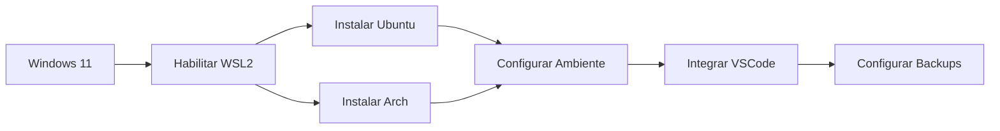

# 🔧 FASE 0: Preparação do Ambiente Multi-Distro WSL

## 📋 Visão Geral da Fase

Esta fase estabelece a base fundamental para todo o desenvolvimento de sistemas operacionais. Você configurará um ambiente seguro, isolado e flexível usando WSL2 com múltiplas distribuições Linux.

## 🎯 Objetivos de Aprendizado

Ao completar esta fase, você será capaz de:

- ✅ Instalar e configurar o WSL2 no Windows 11
- ✅ Gerenciar múltiplas distribuições Linux simultaneamente
- ✅ Configurar ambientes isolados para diferentes propósitos
- ✅ Integrar ferramentas de desenvolvimento (VSCode, Terminal)
- ✅ Implementar estratégias de backup e recuperação
- ✅ Otimizar recursos de CPU e memória por distribuição

## 📊 Informações da Fase

| Métrica | Valor |
|---------|-------|
| **Tempo Estimado** | 20 horas |
| **Dificuldade** | Iniciante |
| **Pré-requisitos** | Windows 11, conhecimento básico de terminal |
| **Distribuições** | Ubuntu 24.04 LTS, Arch Linux |

## 📚 Módulos desta Fase

### [📦 Módulo 0.1: Administração de Múltiplas Distribuições WSL2](./01_configuracao_wsl2.md)
**Tempo: 10 horas**

Aprenda a instalar, configurar e gerenciar múltiplas distribuições WSL2, entendendo os conceitos de virtualização leve e compartilhamento de recursos.

**Tópicos:**
- Conceitos de virtualização leve do WSL2
- Instalação de Ubuntu e Arch Linux
- Comandos essenciais de gerenciamento
- Configuração de recursos por distribuição

---

### [🔒 Módulo 0.2: Configuração de Ambientes Isolados](./02_distros_multiplas.md)
**Tempo: 10 horas**

Configure ambientes de desenvolvimento isolados e seguros, com integração completa com ferramentas modernas de desenvolvimento.

**Tópicos:**
- Estratégias de isolamento e segurança
- Integração com VSCode e terminais modernos
- Sistema de backup e recuperação
- Otimização de performance

## 🛠️ Ferramentas Necessárias

### Essenciais
- **Windows 11** com virtualização habilitada
- **PowerShell** ou Windows Terminal
- **8GB+ RAM** (recomendado 16GB)
- **50GB+ espaço livre** em disco

### Instalações desta Fase
- WSL2
- Ubuntu 24.04 LTS
- Arch Linux (via ArchWSL)
- VSCode com extensão Remote-WSL
- Windows Terminal ou Warp

## 📝 Checklist de Preparação

Antes de começar, verifique:

- [ ] Windows 11 atualizado (versão 22000 ou superior)
- [ ] Virtualização habilitada na BIOS/UEFI
- [ ] Conta de administrador no Windows
- [ ] Conexão estável com internet
- [ ] Espaço em disco suficiente

## 🎮 Fluxo de Trabalho



## 💻 Exemplo Prático

### Verificando WSL2
```powershell
# No PowerShell como Administrador
wsl --status
wsl --list --verbose
```

### Instalando uma Distribuição
```powershell
# Instalar Ubuntu
wsl --install -d Ubuntu-24.04

# Listar distribuições disponíveis
wsl --list --online
```

### Configuração Básica
```bash
# Dentro do WSL Ubuntu
sudo apt update && sudo apt upgrade -y
sudo apt install -y build-essential git curl wget
```

## 📊 Validação de Aprendizado

### Checkpoint 1: WSL2 Funcional
- [ ] WSL2 instalado e funcionando
- [ ] Comando `wsl --version` mostra v2
- [ ] Acesso ao filesystem do Windows

### Checkpoint 2: Múltiplas Distros
- [ ] Ubuntu instalado e configurado
- [ ] Arch Linux instalado e configurado
- [ ] Alternância entre distros funcional

### Checkpoint 3: Ambiente Integrado
- [ ] VSCode abre projetos no WSL
- [ ] Terminal configurado para cada distro
- [ ] Sistema de backup implementado

## 🚨 Problemas Comuns

### WSL2 não inicia
**Sintoma:** Erro "The Windows Subsystem for Linux has not been enabled"
**Solução:**
```powershell
# Como administrador
dism.exe /online /enable-feature /featurename:Microsoft-Windows-Subsystem-Linux /all /norestart
dism.exe /online /enable-feature /featurename:VirtualMachinePlatform /all /norestart
# Reiniciar o computador
```

### Virtualização não habilitada
**Sintoma:** Erro "Please enable the Virtual Machine Platform"
**Solução:** Habilitar virtualização na BIOS/UEFI (Intel VT-x ou AMD-V)

### Falta de espaço em disco
**Sintoma:** VHDX crescendo demais
**Solução:**
```powershell
# Compactar VHDX
wsl --shutdown
Optimize-VHD -Path "caminho\para\ext4.vhdx" -Mode Full
```

## 📚 Recursos Adicionais

### Documentação Oficial
- [Documentação WSL2 Microsoft](https://docs.microsoft.com/pt-br/windows/wsl/)
- [ArchWSL no GitHub](https://github.com/yuk7/ArchWSL)
- [VSCode Remote Development](https://code.visualstudio.com/docs/remote/wsl)

### Tutoriais Recomendados
- [WSL2 Best Practices](https://docs.microsoft.com/en-us/windows/wsl/best-practices)
- [Otimização de Performance WSL2](https://docs.microsoft.com/en-us/windows/wsl/disk-space)

### Comunidades
- [r/bashonubuntuonwindows](https://reddit.com/r/bashonubuntuonwindows)
- [WSL GitHub Discussions](https://github.com/microsoft/WSL/discussions)

## 🎯 Projeto Prático da Fase

### Desafio: Ambiente Multi-Propósito

Crie um setup com:
1. **Ubuntu-OSDev**: Para desenvolvimento de kernel
2. **Arch-Tools**: Para ferramentas e utilities
3. **Script de backup** automatizado
4. **Configuração .wslconfig** otimizada

**Entregáveis:**
- Screenshot das distros funcionando
- Script PowerShell de backup
- Arquivo .wslconfig configurado
- VSCode abrindo projeto em cada distro

## ➡️ Próximos Passos

Após completar todos os checkpoints:

1. ✅ Faça backup das suas distribuições configuradas
2. 📖 Revise os conceitos de virtualização
3. 🚀 Prossiga para [FASE 1: Fundamentos C/C++](../FASE_1_FUNDAMENTOS/README.md)

## 📝 Notas de Progresso

Use este espaço para anotar seu progresso:

```markdown
Data de Início: ___/___/___
Data de Conclusão: ___/___/___

Checkpoints Completos:
- [ ] WSL2 Funcional
- [ ] Múltiplas Distros
- [ ] Ambiente Integrado

Observações:
_________________________________
_________________________________
_________________________________
```

---

**Tempo Total Investido:** _____ horas  
**Dificuldades Encontradas:** _________________  
**Próxima Revisão:** ___/___/___