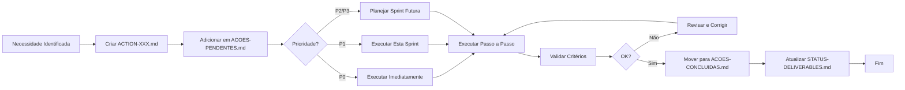
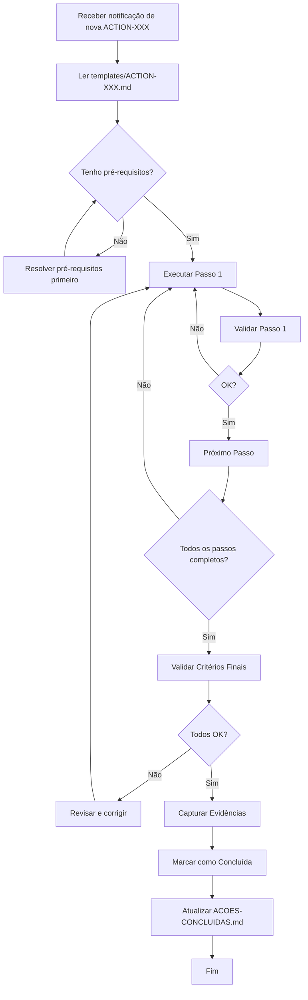

# Sistema de Ações Manuais - Ultrathink

**Versão:** 1.0.0
**Data:** 2025-11-17
**Autor:** Tech Lead
**Status:** Operacional

---

## 📖 Índice

- [O Que É](#-o-que-é)
- [Por Que Separar Ações Manuais](#-por-que-separar-ações-manuais)
- [Como Funciona](#-como-funciona)
- [Como Criar Nova Ação](#-como-criar-nova-ação)
- [Como Marcar como Concluída](#-como-marcar-como-concluída)
- [Integração com Sistema Existente](#-integração-com-sistema-existente)
- [Categorias e Prioridades](#-categorias-e-prioridades)
- [Workflow Recomendado](#-workflow-recomendado)
- [FAQ](#-faq)

---

## 🎯 O Que É

O **Sistema de Ações Manuais** é uma estrutura de documentação para rastrear tarefas que **não podem ser automatizadas** e requerem intervenção humana, como:

- **Configurações de APIs externas** (Google Analytics, secrets)
- **Testes manuais de UI/UX** (screen readers, acessibilidade)
- **Validações de critérios** (performance, compliance, WCAG)
- **Deploy manual** (DNS, SSL, produção)
- **Documentação externa** (wikis, guias corporativos)

### Diferença entre Ações Manuais e User Stories

| Aspecto | User Stories (ROADMAP.md) | Ações Manuais (acoes-usuario/) |
|---------|---------------------------|-------------------------------|
| **Executor** | Claude Code + Desenvolvedor | Usuário humano (manual) |
| **Automação** | Pode ser automatizada | Não pode ser automatizada |
| **Escopo** | Implementação de features | Configuração, validação, deploy |
| **Rastreamento** | STATUS-DELIVERABLES.md | ACOES-PENDENTES.md |
| **Exemplo** | "Implementar React Router" | "Configurar Google Analytics 4" |

---

## 🤔 Por Que Separar Ações Manuais?

### Problema Antes
Antes deste sistema, ações manuais estavam misturadas em:
- User Stories no ROADMAP.md (mas não eram código)
- Checklists em STATUS-DELIVERABLES.md (sem detalhes)
- Comentários em issues (sem rastreamento)
- Memória do desenvolvedor (risco de esquecimento)

**Resultado:** Ações manuais críticas eram esquecidas ou executadas incorretamente.

### Solução Agora
Com este sistema:
- ✅ **Rastreamento dedicado:** ACOES-PENDENTES.md é a fonte de verdade
- ✅ **Templates padronizados:** Sempre com passo a passo e validação
- ✅ **Priorização clara:** P0 (blocker) → P3 (low)
- ✅ **Histórico completo:** ACOES-CONCLUIDAS.md mantém registro
- ✅ **Integração com Deliverables:** Cada ação vinculada a um D-XXX

---

## ⚙️ Como Funciona

### Ciclo de Vida de uma Ação



### Estrutura de Arquivos

```
docs/backlog/acoes-usuario/
├── README.md                      # Este arquivo (guia completo)
├── ACOES-PENDENTES.md            # Lista principal (SSOT para pendentes)
├── ACOES-CONCLUIDAS.md           # Histórico de ações finalizadas
└── templates/
    ├── template-acao.md          # Template base para criar ações
    ├── ACTION-001.md             # Exemplo: Validar Build de Produção
    ├── ACTION-002.md             # Exemplo: Configurar Analytics B2B
    └── ACTION-003.md             # Exemplo: Testar Acessibilidade WCAG
```

---

## 🆕 Como Criar Nova Ação

### Passo 1: Identificar Necessidade

**Perguntas a fazer:**
- [ ] Esta tarefa pode ser automatizada? Se sim, criar User Story.
- [ ] Esta tarefa requer intervenção humana? Se sim, criar Ação Manual.
- [ ] Qual é a prioridade? (P0 = blocker, P1 = sprint atual, P2/P3 = futuro)
- [ ] Qual deliverable está bloqueado por esta ação?

### Passo 2: Copiar Template

```bash
cd /home/notebook/workspace/app-controle/docs/backlog/acoes-usuario/templates/

# Próximo número disponível (verificar em ACOES-PENDENTES.md)
cp template-acao.md ACTION-004.md
```

### Passo 3: Preencher Metadados (Frontmatter)

```yaml
---
id: ACTION-004
titulo: "[Título Descritivo da Ação]"
prioridade: P0|P1|P2|P3
status: PENDENTE
categoria: setup|testing|validation|deployment|documentation
deliverable: D-XXX
sprint: "[Nome da Sprint]"
created: 2025-11-17
updated: 2025-11-17
completed: null
estimativa: "[X horas/dias]"
responsavel: "[Nome ou Função]"
---
```

**Dicas para preenchimento:**
- **id:** Sequencial (verificar último ACTION-XXX criado)
- **titulo:** Claro e acionável (começar com verbo: "Configurar...", "Validar...", "Testar...")
- **prioridade:** Ver seção [Prioridades](#prioridades)
- **categoria:** Ver seção [Categorias](#categorias)
- **deliverable:** Buscar em STATUS-DELIVERABLES.md
- **estimativa:** Tempo realista (incluir margem de segurança)

### Passo 4: Preencher Conteúdo

**Seções obrigatórias:**
1. **📋 Descrição** - O que precisa ser feito (1-2 parágrafos)
2. **🎯 Contexto** - Por que é necessário + relação com Deliverables
3. **📝 Passo a Passo** - Instruções detalhadas (comandos, screenshots)
4. **✅ Validação** - Como validar que foi feito corretamente
5. **🎁 Resultado Esperado** - Estado final + evidências
6. **📌 Notas** - Referências, riscos, tempo estimado

**Boas práticas:**
- Escrever para alguém que **não conhece o contexto**
- Incluir **comandos exatos** (copiar-colar)
- Adicionar **validações objetivas** (não subjetivas)
- Documentar **riscos e mitigações**
- Linkar **documentação oficial** quando possível

### Passo 5: Adicionar em ACOES-PENDENTES.md

Editar `ACOES-PENDENTES.md`:

1. **Atualizar header:**
   ```markdown
   **Status:** 4 ações pendentes  # Incrementar
   **Prioridades:** P0: 0 | P1: 3 | P2: 1 | P3: 0  # Atualizar contadores
   ```

2. **Adicionar na seção correta (P0, P1, P2, ou P3):**
   ```markdown
   ### ACTION-004: [Título da Ação]
   **Categoria:** [categoria] | **Deliverable:** D-XXX
   **Responsável:** [nome] | **Estimativa:** [tempo]

   **Descrição:**
   [Resumo de 1 parágrafo]

   **Passo a Passo Resumido:**
   1. [Passo 1]
   2. [Passo 2]
   3. [Passo 3]

   **Critérios de Validação:**
   - [ ] [Critério 1]
   - [ ] [Critério 2]

   **Referência Completa:** [templates/ACTION-004.md](templates/ACTION-004.md)
   ```

3. **Atualizar Métricas:**
   ```markdown
   | Prioridade | Pendentes | Estimativa Total |
   |-----------|-----------|------------------|
   | P1 (High) | 3 | 9h |  # Atualizar números
   ```

### Passo 6: Commitar Alterações

```bash
git add docs/backlog/acoes-usuario/
git commit -m "docs: adicionar ACTION-004 - [Título da Ação]"
```

---

## ✅ Como Marcar como Concluída

### Passo 1: Validar Critérios

Antes de marcar como concluída, **verificar todos os critérios de validação**:
- [ ] Todos os passos foram executados
- [ ] Todos os critérios de validação foram cumpridos
- [ ] Evidências foram capturadas (screenshots, logs, etc.)
- [ ] Resultado esperado foi atingido

### Passo 2: Atualizar Arquivo da Ação

Editar `templates/ACTION-XXX.md`:

```yaml
---
status: CONCLUIDA  # Atualizar
completed: 2025-11-17  # Adicionar data
---
```

No final do arquivo:
```markdown
---

**Status:** CONCLUIDA  # Atualizar
**Última Atualização:** 2025-11-17  # Atualizar data
**Concluída em:** 2025-11-17 por [Nome]  # Adicionar linha
```

### Passo 3: Mover para ACOES-CONCLUIDAS.md

Editar `ACOES-CONCLUIDAS.md`:

1. **Atualizar header:**
   ```markdown
   **Total de Ações Concluídas:** 2  # Incrementar
   ```

2. **Adicionar na seção do mês (criar se não existir):**
   ```markdown
   ### 2025-11 (Novembro 2025)

   #### ACTION-004: [Título da Ação]
   **Categoria:** [categoria] | **Deliverable:** D-XXX
   **Responsável:** [nome] | **Estimativa:** [tempo]
   **Concluída em:** 2025-11-17

   **Descrição:**
   [Resumo]

   **Passo a Passo Executado:**
   1. ✅ [Passo 1]
   2. ✅ [Passo 2]
   3. ✅ [Passo 3]

   **Resultado:**
   [Resultado alcançado]

   **Evidências:**
   - [x] [Evidência 1]
   - [x] [Evidência 2]
   ```

3. **Atualizar estatísticas:**
   ```markdown
   ### Por Categoria
   | Categoria | Concluídas |
   |-----------|-----------|
   | setup | 1 |  # Incrementar categoria relevante
   ```

### Passo 4: Remover de ACOES-PENDENTES.md

Editar `ACOES-PENDENTES.md`:

1. **Atualizar header:**
   ```markdown
   **Status:** 3 ações pendentes  # Decrementar
   **Prioridades:** P0: 0 | P1: 2 | P2: 1 | P3: 0  # Atualizar
   ```

2. **Deletar seção da ação**

3. **Atualizar métricas:**
   ```markdown
   | Prioridade | Pendentes | Estimativa Total |
   |-----------|-----------|------------------|
   | P1 (High) | 2 | 6h |  # Decrementar
   ```

### Passo 5: Atualizar STATUS-DELIVERABLES.md (se aplicável)

Se a ação estava vinculada a um deliverable, editar `../STATUS-DELIVERABLES.md`:

```markdown
### D-XXX: [Nome do Deliverable]
**Ações Manuais:**
- [x] ACTION-004 - [Título da Ação] ✅  # Marcar como concluída
```

### Passo 6: Commitar Alterações

```bash
git add docs/backlog/acoes-usuario/ docs/backlog/STATUS-DELIVERABLES.md
git commit -m "docs: concluir ACTION-004 - [Título da Ação]"
```

---

## 🔗 Integração com Sistema Existente

### Relação com Outros Documentos

```
ROADMAP.md (SSOT para produto)
    ↓
    Contém 4 Releases planejadas
    Cada Release tem N User Stories (US-XXX)
    ↓
STATUS-DELIVERABLES.md (SSOT para entregas)
    ↓
    Rastreia progresso de Deliverables (D-XXX)
    Cada Deliverable vinculado a US-XXX
    ↓
ACOES-PENDENTES.md (SSOT para ações manuais)
    ↓
    Lista ações que bloqueiam/complementam D-XXX
    Cada ACTION-XXX vinculada a D-XXX
    ↓
templates/ACTION-XXX.md (detalhes de cada ação)
    ↓
    Passo a passo detalhado para executar
```

### Exemplo de Fluxo Completo

**Cenário:** Implementar React Router (US-040)

1. **ROADMAP.md:**
   ```markdown
   ### US-040: Migrar navegação para React Router v6
   - Implementar roteamento hierárquico
   - Lazy loading de rotas
   - Breadcrumb navigation
   ```

2. **STATUS-DELIVERABLES.md:**
   ```markdown
   ### D-026: Implementar React Router
   **Status:** 🟠 Em Andamento
   **Ações Manuais:**
   - [ ] ACTION-001 - Validar Build de Produção
   ```

3. **ACOES-PENDENTES.md:**
   ```markdown
   ### ACTION-001: Validar Build de Produção
   **Deliverable:** D-026 (React Router)
   [Detalhes...]
   ```

4. **Execução:**
   - Desenvolvedor implementa US-040 (código)
   - Usuário executa ACTION-001 (validação manual)
   - Marca ACTION-001 como concluída
   - Atualiza D-026 para 🟢 Completo

---

## 📊 Categorias e Prioridades

### Categorias

#### 1. setup (Configuração)
**O que é:** Configurações de ambiente, APIs externas, secrets, credenciais

**Exemplos:**
- Configurar Google Analytics 4
- Adicionar API key do Stripe
- Configurar variáveis de ambiente de produção
- Setup de domínio e DNS

**Quando usar:** Tarefa envolve configurar algo **fora do código** (APIs, secrets, infra)

---

#### 2. testing (Testes Manuais)
**O que é:** Testes que não podem ser automatizados (UI, usabilidade, flows complexos)

**Exemplos:**
- Validar build de produção
- Testar fluxo completo de onboarding
- Validar responsividade em dispositivos reais
- Testar integração com sistemas externos

**Quando usar:** Tarefa envolve **testar manualmente** algo que não tem teste automatizado

---

#### 3. validation (Validação de Critérios)
**O que é:** Validações de compliance, performance, acessibilidade, segurança

**Exemplos:**
- Validar conformidade WCAG 2.1 AA
- Testar performance (Core Web Vitals)
- Validar compliance LGPD
- Security audit manual

**Quando usar:** Tarefa envolve **validar critérios técnicos ou legais**

---

#### 4. deployment (Deploy Manual)
**O que é:** Deploys, releases, configurações de produção

**Exemplos:**
- Deploy em produção (primeira vez)
- Configurar SSL/TLS
- Migração de banco de dados
- Rollback de release

**Quando usar:** Tarefa envolve **deploy ou operações de produção**

---

#### 5. documentation (Documentação Externa)
**O que é:** Documentação fora do repositório (wikis, guias, apresentações)

**Exemplos:**
- Criar guia de onboarding para clientes B2B
- Atualizar wiki corporativa
- Criar apresentação de release
- Documentar APIs para parceiros

**Quando usar:** Tarefa envolve **documentação para audiência externa**

---

### Prioridades

#### P0 - BLOCKER (Urgente)
**O que é:** Ação que **bloqueia desenvolvimento ou release**. Deve ser resolvida **imediatamente**.

**Critérios para P0:**
- [ ] Bloqueia trabalho de outros desenvolvedores
- [ ] Bloqueia release agendado
- [ ] Issue de produção crítico (downtime, segurança)
- [ ] Compliance legal com deadline próximo

**Exemplos:**
- Configurar API key de produção (sem ela, release não pode acontecer)
- Corrigir issue crítico de segurança em produção
- Migração de banco com deadline legal
- Restaurar backup após incidente

**SLA:** Resolver em **< 4 horas**

---

#### P1 - HIGH (Sprint Atual)
**O que é:** Ação **necessária para concluir deliverables da sprint atual**. Deve ser resolvida **esta semana**.

**Critérios para P1:**
- [ ] Necessária para completar D-XXX da sprint atual
- [ ] Bloqueia validação de US-XXX implementada
- [ ] Requerida para testes de QA
- [ ] Dependency de P0 (após resolver P0, vira P1)

**Exemplos:**
- Validar build de produção (após implementar feature)
- Testar acessibilidade WCAG (antes de release)
- Configurar analytics para nova feature
- Validar performance após refatoração

**SLA:** Resolver em **1-3 dias**

---

#### P2 - MEDIUM (Sprints Futuras)
**O que é:** Ação **necessária para releases futuros**. Deve ser planejada e executada **nas próximas 2-4 semanas**.

**Critérios para P2:**
- [ ] Necessária para D-XXX de sprint futura
- [ ] Melhoria não-crítica (nice-to-have mas importante)
- [ ] Preparação para feature futura
- [ ] Documentação complementar

**Exemplos:**
- Configurar analytics para dashboard futuro
- Documentar APIs para integração futura
- Setup de staging environment
- Migração de ferramenta (não urgente)

**SLA:** Resolver em **2-4 semanas**

---

#### P3 - LOW (Backlog)
**O que é:** Ação **nice-to-have, não-bloqueante**. Pode ser executada **quando houver disponibilidade**.

**Critérios para P3:**
- [ ] Melhoria incremental (não é necessária)
- [ ] Otimização não-crítica
- [ ] Documentação adicional (não-obrigatória)
- [ ] Exploração/pesquisa

**Exemplos:**
- Configurar ferramenta opcional de monitoring
- Criar guia avançado para power users
- Testar ferramenta alternativa (pesquisa)
- Otimização de performance não-crítica

**SLA:** Resolver quando **houver tempo disponível**

---

## 🔄 Workflow Recomendado

### Para Claude Code (AI)

1. **Ao criar User Story que requer ação manual:**
   ```markdown
   # No final da implementação de US-XXX

   ⚠️ AÇÃO MANUAL REQUERIDA

   Esta implementação requer a seguinte ação manual:
   - [ ] Criar ACTION-XXX para [descrever ação]
   - Categoria sugerida: [setup|testing|validation|deployment|documentation]
   - Prioridade sugerida: [P0|P1|P2|P3]
   - Deliverable: D-XXX
   ```

2. **Ao detectar necessidade de validação:**
   ```markdown
   ✅ Implementação completa

   📋 Próximo Passo Manual:
   Executar ACTION-XXX para validar [critério]
   Referência: docs/backlog/acoes-usuario/templates/ACTION-XXX.md
   ```

### Para Usuário Humano

#### Workflow Semanal

**Segunda-feira (Planejamento):**
1. Abrir `ACOES-PENDENTES.md`
2. Verificar ações P0 (se houver, resolver imediatamente)
3. Planejar P1 para a semana
4. Atribuir P2 para sprints futuras

**Durante a semana (Execução):**
1. Executar P1 conforme cronograma
2. Seguir passo a passo em `templates/ACTION-XXX.md`
3. Validar todos os critérios antes de marcar como concluída
4. Capturar evidências (screenshots, logs)

**Sexta-feira (Review):**
1. Mover ações concluídas para `ACOES-CONCLUIDAS.md`
2. Atualizar `STATUS-DELIVERABLES.md`
3. Re-priorizar ações pendentes se necessário
4. Planejar próxima semana

#### Workflow Por Ação



---

## ❓ FAQ

### 1. Quando criar Ação Manual vs User Story?

**Criar Ação Manual quando:**
- ✅ Tarefa **não pode ser automatizada** (requer interação humana)
- ✅ Envolve **sistemas externos** (APIs, infra, configurações)
- ✅ Requer **validação manual** (testes de UI, acessibilidade)
- ✅ É **deploy ou operação** de produção

**Criar User Story quando:**
- ✅ Tarefa pode ser **implementada em código**
- ✅ Claude Code pode **automatizar** a execução
- ✅ É uma **feature** ou **bug fix**
- ✅ Tem **testes automatizados**

### 2. Posso ter múltiplas ações para um deliverable?

**Sim!** É comum ter várias ações manuais para um deliverable.

**Exemplo:**
```markdown
### D-026: Implementar React Router
**Ações Manuais:**
- [ ] ACTION-001 - Validar Build de Produção
- [ ] ACTION-005 - Testar Performance Core Web Vitals
- [ ] ACTION-008 - Deploy em Staging
- [ ] ACTION-012 - Deploy em Produção
```

### 3. Como priorizar quando tenho muitas P1?

**Critérios de desempate:**
1. **Dependências:** Priorizar ações que desbloqueiam outras
2. **Deliverable:** Priorizar ações de deliverables mais próximos de concluir
3. **Risco:** Priorizar ações com maior risco de falha
4. **Tempo:** Executar ações rápidas primeiro (quick wins)

**Dica:** Se tem > 5 ações P1, considerar mover algumas para P2.

### 4. Preciso seguir o passo a passo exatamente?

**Depende:**
- ✅ **Seguir exatamente:** Ações de deploy, segurança, compliance
- ⚠️ **Adaptar se necessário:** Ações de testing, validação (mas documentar mudanças)
- ❌ **Não pular passos:** Sempre executar validações

**Se adaptar, documentar:**
```markdown
## 📌 Notas de Execução

**Adaptações realizadas:**
- Passo 3: Usei ferramenta alternativa X ao invés de Y
- Validação: Adicionei critério Z para garantir [motivo]
```

### 5. O que fazer se a ação falhar na validação?

**Fluxo de falha:**
1. **Documentar falha:**
   ```markdown
   ## ⚠️ Tentativa 1 - FALHOU (2025-11-17)

   **Problema encontrado:**
   [Descrição do problema]

   **Causa raiz:**
   [Por que falhou]

   **Ação corretiva:**
   [O que será feito diferente]
   ```

2. **Revisar pré-requisitos:** Verificar se todos os pré-requisitos estavam OK

3. **Pedir ajuda:** Se não souber resolver, escalar para Tech Lead

4. **Criar ACTION-XXX adicional:** Se descobrir que falta configuração prévia

5. **Tentar novamente:** Após correção, re-executar validação

### 6. Como lidar com ações que dependem de terceiros?

**Exemplo:** "Configurar API key do Stripe" depende de receber credenciais do financeiro.

**Solução:**
1. **Marcar status como bloqueada:**
   ```yaml
   status: BLOQUEADA
   bloqueio: "Aguardando API key do financeiro"
   ```

2. **Adicionar nota em ACOES-PENDENTES.md:**
   ```markdown
   ### ACTION-XXX: Configurar API Stripe
   **Status:** ⏸️ BLOQUEADA (aguardando API key)
   ```

3. **Criar lembretes:** Adicionar reminder para cobrar terceiro

4. **Quando desbloquear:** Atualizar status para PENDENTE e executar

### 7. Posso deletar ações concluídas antigas?

**Não recomendado.**

**Por que manter histórico:**
- ✅ Referência futura (como foi feito da última vez)
- ✅ Auditoria (compliance, rastreabilidade)
- ✅ Onboarding (novos membros entendem histórico)
- ✅ Métricas (quantas ações foram necessárias por deliverable)

**Se realmente necessário:**
- Mover para arquivo de arquivo: `ACOES-CONCLUIDAS-2025.md`
- Manter últimos 6 meses em ACOES-CONCLUIDAS.md

### 8. Como criar ação que se repete periodicamente?

**Exemplo:** "Validar backups de produção" (mensal)

**Solução - Ação Recorrente:**
```yaml
---
id: ACTION-999
titulo: "[RECORRENTE] Validar Backups de Produção"
prioridade: P1
status: PENDENTE
categoria: validation
recorrencia: mensal
proxima_execucao: 2025-12-01
---
```

**Workflow:**
1. Executar ação conforme passo a passo
2. Marcar como concluída
3. Criar nova ACTION-XXX para próximo mês
4. Atualizar `proxima_execucao`

**Alternativa - Automação:**
Se possível, considerar automatizar com script + cron job.

---

## 📚 Referências

### Documentos Relacionados
- [ROADMAP.md](../ROADMAP.md) - Product Requirements Document (SSOT)
- [STATUS-DELIVERABLES.md](../STATUS-DELIVERABLES.md) - Rastreamento de entregas
- [PROXIMAS-ETAPAS.md](../PROXIMAS-ETAPAS.md) - Próximos passos técnicos

### Padrões e Metodologias
- [Conventional Commits](https://www.conventionalcommits.org/)
- [WCAG 2.1 Guidelines](https://www.w3.org/WAI/WCAG21/quickref/)
- [Agile User Stories](https://www.atlassian.com/agile/project-management/user-stories)

### Ferramentas Úteis
- [axe DevTools](https://www.deque.com/axe/devtools/) - Accessibility testing
- [Lighthouse](https://developers.google.com/web/tools/lighthouse) - Performance audit
- [Google Analytics 4](https://analytics.google.com/) - Analytics setup
- [pa11y](https://pa11y.org/) - Automated accessibility testing

---

**Última Atualização:** 2025-11-17
**Versão:** 1.0.0
**Status:** Operacional
**Próxima Review:** Após implementação de 10 ações
